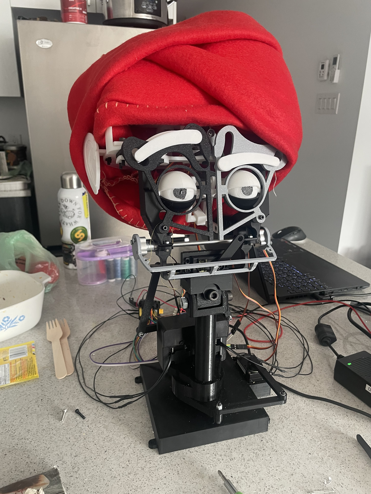
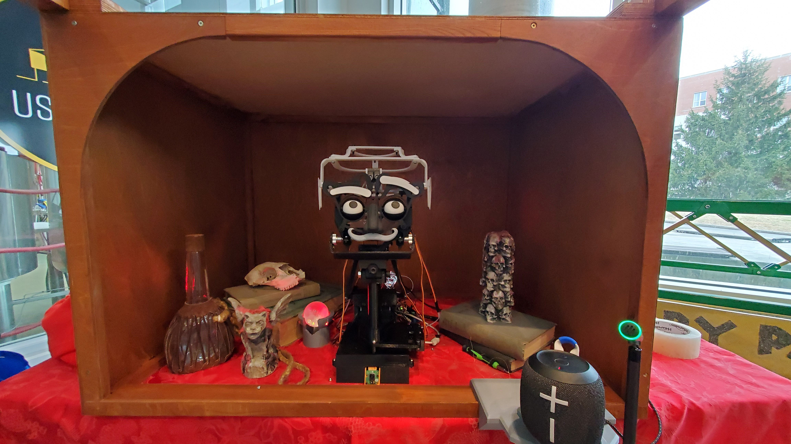

# Projet Animatronique : Marcus

Ce dépôt contient le code et la structure d’architecture pour un système d’animatronique capable de détecter des visages, reconnaître des émotions, parler et bouger la tête via des servomoteurs. L’objectif est de permettre à *Marcus* de réagir en temps réel aux personnes qui l’entourent (détection du regard, conversation audio, expressions faciales, etc.).

---

<!-- HTML image Marcus (resized) -->


<!-- HTML image Setup (resized) -->



## Aperçu du fonctionnement

Le diagramme ci-dessous illustre le flux de Communication/Fonctionnement entre les différents composants :

- **Raspberry Pi**  
  *Caméra + Reconnaissance faciale + Reconnaissance d'émotion*  
  Envoi de la position `(x,y,z)` et des émotions détectées via MQTT au PC

- **PC central**  
  - Fait office de **Broker MQTT** 
  - Utilise **Whisper** (STT) pour la reconnaissance vocale  
  - Fait des requêtes au **LLM externe** (OpenAI) via une API REST (avec le contexte : texte + émotion)  
  - Renvoie une réponse texte
  - Gère la **synthèse vocale (TTS)** pour parler via un haut-parleur

- **Arduino OpenRB-150** (contrôle des servos)  
  - Reçoit des commandes UART (*REGARDE, SURPRIS, NON IMPRESSIONER, etc.*)  
  - Envoie son statut (*ready*) au départ  
  - Contrôle effectif des mouvements de la tête

- **Arduino MEGA** (contrôle boule de cristal)  
  - Reçoit des commandes UART (*ALLUME et ÉTEINT*)  
  - Envoie son statut (*ready*) au départ  
  - Contrôle effectif des lumières de la boule de cristal

---

## Structure générale

```bash
marcus/
├── docs/
│   └── ... (Documentation, schémas, etc.)
├── Code/
│   ├── Com/                      (Fonctions de communication MQTT et UART en python)
│   │   └── test_MQTT                             (Code test MQTT entre PC et PI)
│   │   └── test_MQTT_will.py                     (Code test MQTT entre PC et PI avec départ Mosquitto auto)
│   │   └── Test.py                               (Code test pour envoie de commande manuel au OpenRB-150)
│   │   └── dyn_test.py                           (Code test pour envoie de commande manuel spécialisé pour le cou et dynamixel)
│   │   └── Venv_setup.bat                        (Executable pour installer un environnement virtuel avec les requirements automatiquement)
│   │
│   ├── LLM/
│   │   └── Marcus_multithread_mqtt_servo.py      (Code principal avec integration complète)
│   │
│   ├── Servo/                    (Dossier platformio : Contient le code l'arduino OpenRB-150)
│   │   ├── src/main.cpp                          (Code principal de l'arduino)
│   │   ├── test/Demo.cpp                         (Demo de foncitonnement des moteurs dynamixel)
│   │   └── test/Scan.cpp                         (Code de détection des ID moteurs dynamixel)
│   │   └── test/main_backup.cpp                  (Code main fourni au départ peu modifier)
│   │   └── README                                (Quelque explication du fonctionnement de OpenRB-150)
│   │
│   └── Pi/
│       ├── FaceRecognition.py    (Détection visage, émotion et envoie info MQTT)
│       ├── EmotionRecognitionTraining.py         (Entrainnement d'un modèle IA avec la banque de donné FER2013)
│       ├── fer2013.zip                           (Banque de données FER2013 voir site officiel pour license)
│       ├── haarcascade_frontalface_default.xml   (Modèle IA pour détection de visage voir site officiel pour license)
│       ├── emotion_recognition_model.h5          (Modèle IA entrainé utiliser avec FaceRecognition)
│       ├── 60_model.h5                           (Alternative de modèle IA)
│       └── setup_venv.sh                         (Executable pour installer un environnement virtuel avec les requirements automatiquement)
│
├── STL                           (Dernier fichier stl des pièces imprimer)
│
└── README.md                     (Vous êtes ici)
exit

## License

### 🗣️ Text-to-Speech (TTS)

This project uses [edge-tts](https://github.com/rany2/edge-tts) to generate speech using Microsoft's Edge TTS engine.
